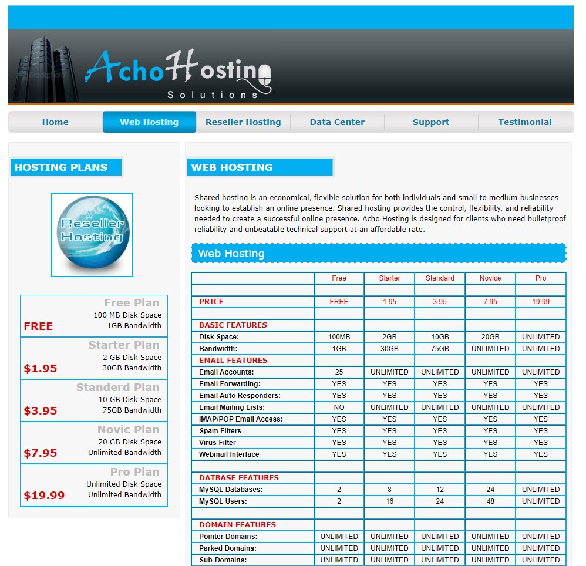
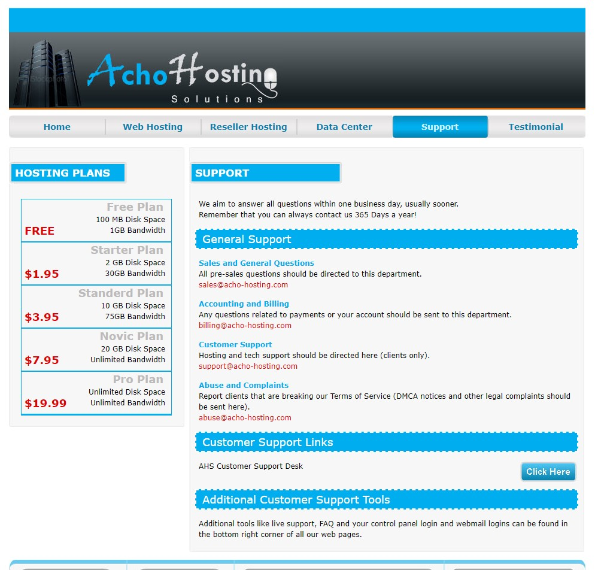

# Dynamic-Website-Development
<u>Dynamic Website Development for Acho Hosting Solutions</u>

I designed and developed a dynamic website for Acho Hosting Solutions,
an internet hosting and data center provider. The website showcases key
features such as web hosting, reseller hosting, and a support page, all
built using my expertise in HTML, CSS, and JavaScript. I used Flask and
Python for deployment, which allowed me to create a seamless user
experience by connecting the website to the backend database. This
project gave me insights into data flow from the website to databases or
the cloud, showcasing my proficiency in web development and deployment.
I am confident that these skills and experiences will add value to my
career as a Data Analyst, as I can apply them to develop innovative
solutions and make better data-driven decisions. This project is a
testament to my passion for technology and my commitment to continuous
learning and professional growth.

Overall, this project demonstrates my skills in web development,
programming languages, and back-end database connectivity.

Images of the website below for your view:

